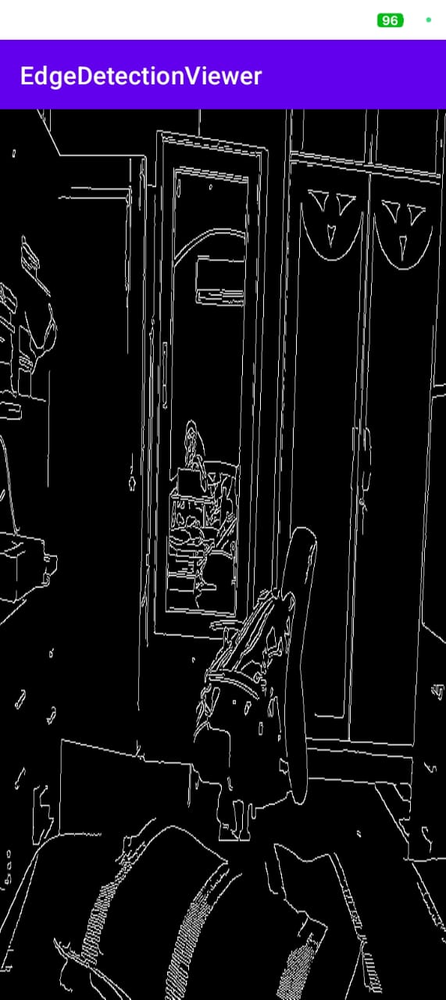
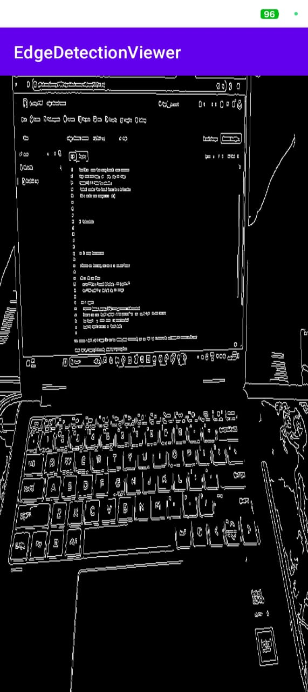
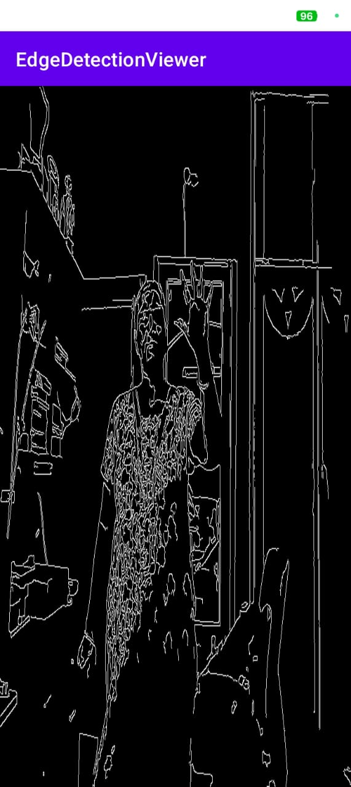

# edge-detect-viewer

This a real-time Android app that captures camera frames, detects edges using OpenCV, and renders the result with OpenGL ES.

---

##  Features Implemented

- Real-time camera feed using OpenCV `JavaCameraView`
- Edge detection using `cv::Canny` via JNI (C++)
- OpenGL ES 2.0 rendering pipeline
- Texture updates from OpenCV frames to GLSurfaceView
- JNI + native code integration (NDK)

---

##  Screenshots




---

## ⚙ Setup Instructions

> Ensure the following are set up in Android Studio:

### 1. NDK and CMake
- Go to **File > Project Structure > SDK Location**
- Set **NDK path** or install via SDK Manager

### 2. OpenCV
- Download [OpenCV Android SDK](https://opencv.org/releases/)
- Extract and copy `OpenCV-android-sdk/sdk/native/libs` and `jni/include` to your project
- Add OpenCV `.so` files under `src/main/jniLibs/`
- Load the OpenCV library in `MainActivity`:

```java
static {
    System.loadLibrary("opencv_java4");
    System.loadLibrary("edgedetectionviewer");
}
```


## Architecture Overview-
# Frame Flow:
1.OpenCV captures frames using JavaCameraView

2.Frame passed to GLRenderer.updateFrame(Mat)

3.JNI method updateTextureFromFrame() processes the frame using Canny edge detection in native C++

4.Processed frame is uploaded as a texture using OpenGL ES and drawn in GLSurfaceView

# Components:
1.MainActivity.java: handles camera input and OpenCV initialization

2.GLRenderer.java: OpenGL logic for rendering frames

3.native-lib.cpp: C++ logic for edge detection + OpenGL texture updates

4.CMakeLists.txt: builds native code using NDK

## About This Project-
This project was built as part of a technical assessment — and it's extra special because when I started, I had little to no prior experience with the core technologies involved.

In just about two and a half days, I went from unfamiliarity to comfortably working with:

OpenCV (C++) for real-time edge detection

JNI to bridge native C++ with Android

OpenGL ES for rendering processed frames

And built the whole thing into an Android app using Android Studio

The learning curve was steep, but with consistent effort and late-night debugging sessions, I not only understood the concepts but also got them working together in one functional project.
While the final product isn't perfect, it is result of curiosity and growth and i will continue to make upadtes until it is in a viable working condition.


